[[Tiếng Việt]](README.md)

# Plants Versus Zombie - Kaito-NMH-Edition

- Game demo: https://youtu.be/EyTwTOWr5zU
- Game playthrough: https://youtu.be/0RQHeCaz4sg

# Game Introduction

Plants versus Zombies is a tower defense game that immerses players in a battle between plants and zombies. Players must
do their best to protect their house using only strange types of plants. By planting and harvesting these plants,
players can destroy the various types of zombies that are attacking their house.

- [0. How to download the game](#0-how-to-download-the-game)
    - [a. Option 1: Without source code.](#a-option-1-without-source-code)
    - [b. Option 2: With source code and can be compiled.](#b-option-2-with-source-code-and-can-be-compiled)
- [1. Starting the game](#1-starting-the-game)
- [2. Choosing a level](#2-choosing-a-level)
- [3. Components of the game:](#3-components-of-the-game)
- [4. How to play](#4-how-to-play)
    - [a. Types of plants](#a-types-of-plants)
    - [b. Types of zombies](#b-types-of-zombies)
- [5. Winning and losing](#5-winning-and-losing)
- [About the game's graphics:](#about-the-games-graphics)
- [About the game's source code](#about-the-games-source-code)

# 0. How to download the game

## a. Option 1: Without source code.

Download the game (compressed into a .rar file) at the following
link: https://drive.google.com/drive/u/0/folders/1awM0sfex1InCzlSA1ZIenKUGbhhC_hc0 
This method saves a lot of memory and download time (around 90MB). 
Extract the game into a folder and run pvz.exe to play. 

## b. Option 2: With source code and can be compiled.

**Step 1:** Clone this repo (About 800 MB - includes version history).  
Or select Code -> Download Zip (About 90MB)

**All the code is in the src folder. 
**You can skip to step 5 to start playing.

**Step 2:** Install MinGW. Here, I install the MinGW-W64
GCC-8.1.0 [x86_64-posix-seh](https://sourceforge.net/projects/mingw-w64/files/Toolchains%20targetting%20Win64/Personal%20Builds/mingw-builds/8.1.0/threads-posix/seh/x86_64-8.1.0-release-posix-seh-rt_v6-rev0.7z/download)
version. 
Some notes:  

- If you use another compiler, you need to recompile the icon: go to the icon folder and use the
  command `windres main.rc -O coff main.res` in cmd. 
- You need to delete three c++ dll files in the folder containing
  pvz.exe: `libgcc_s_seh-1.dll`, `libstdc++-6.dll`, `libwinpthread-1.dll`. These dll files are only for players who
  don't have c++ installed on their computer.

**Step 3:** Install GNU make.

**Step 4:** Open cmd in the folder containing the Makefile and type the command "make".

**Step 5:** Run pvz.exe and start playing.

# 1. Starting the game

Wait a few seconds and then click on the "CLICK TO START!" button to start playing the game.

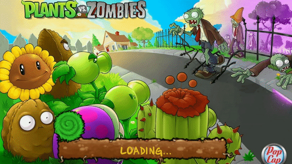

When entering the game for the first time, players should enter their name to start the game. Then click "OK" or press
Enter to continue.

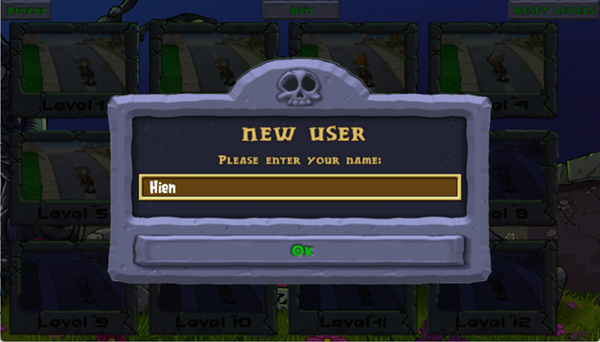

Players will immediately receive their first plant - the Peashooter.

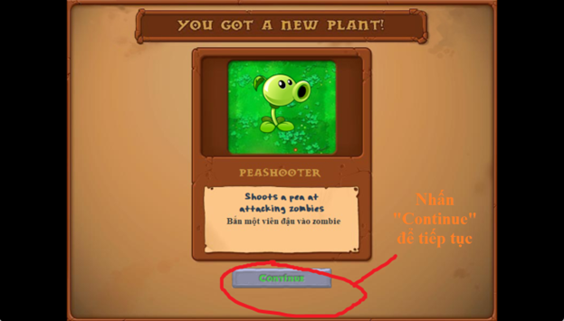

# 2. Choosing a level

There are a total of 12 levels with varying levels of difficulty for players to choose from. When hovering over a level,
that level will light up. Simply click the mouse to play that level.

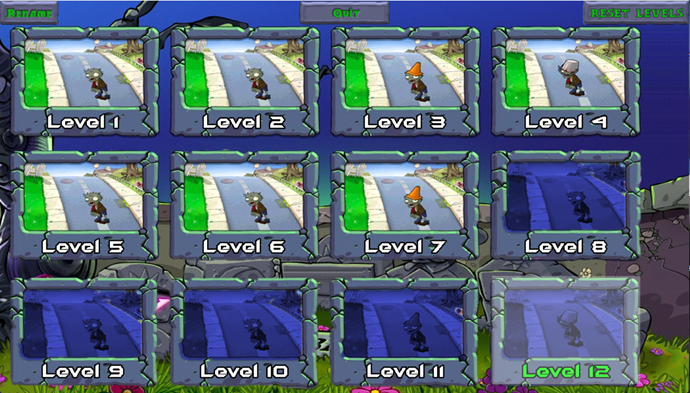

However, when starting out, you can only unlock 1 level. Win each level in order to unlock and play the next level:

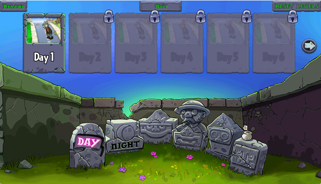

In addition, there are 3 other function buttons for players to change their name, close the game, or even reset the game
progress to experience the game again from the beginning:

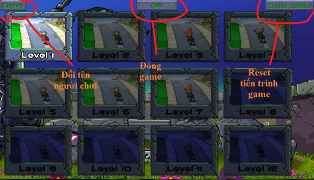

When entering the game, there are 2 types of levels that players will encounter: morning (left side) and night (right
side).

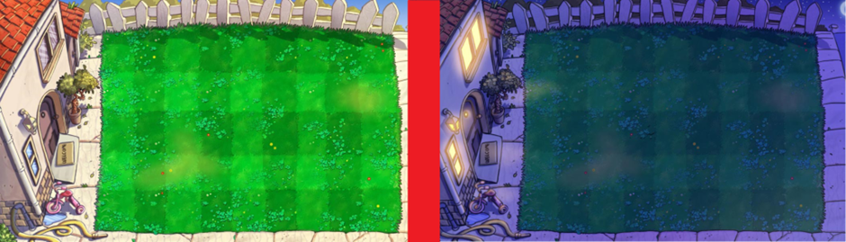

- In the morning, there will occasionally be sun (sun) falling from the sky.
- In the night, there is none, so the game will be slightly harder.

Before starting the game, you will know what types of zombies will appear.

# 3. Components of the game:

- Sun

: a unit to buy plants in the game. Click to collect. And note that if a sun exists for too long, it will gradually fade
and disappear. You won't be able to collect them after they disappear.

- Sun bar

: a scoreboard of the number of suns that the player currently has.

- Plant seeds: all types of plants that the player owns. To select a plant to plant, the player must click on the plant
  seed or press keys 1, 2, 3, 4, 5 (as marked in the game) to select the plant and then plant it on the field. Of
  course, you must have enough sun to buy the plant, and the plant seed must have a different waiting time to plant that
  type of plant again.

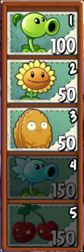

- Shovel: an extremely effective tool for you to dig up unnecessary plants and replace them with new ones.

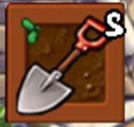

- Game progress bar: a bar that you can follow to see how many zombies are left to come or how many parts of the level
  you have played. On the left is the current level you are playing.

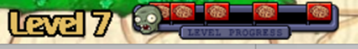

- Turbo button: If you find the game too slow or too easy and you need to save time, press the button to experience the
  game at twice the original speed.
- And if you find the game too scary at this speed, just press it again to return to normal speed.
  ● Game at the original speed:

● Game currently at twice the original speed:

- Pause Button: Do you need to pause the game to play later? Or do you want to adjust the volume of the background music
  and sound effects? Too simple, the game can be paused by clicking

or clicking outside the game.

- Mower: If you leave zombies too close to your house, the mower will automatically activate and destroy all zombies
  currently in that row. Note that there is only one mower per row.

- Basic game layout:

# 4. How to play

Plant plants to attack and defend, and prevent zombies from entering your house. 
To plant a plant, select the seed of that plant (using the keyboard or mouse) and place it in the desired square.  
You can dig up plants in use with a shovel. 
Plants will be eaten by zombies.

## a. Types of plants

There are 5 types of plants, in order of availability in the game:

|                                                                             | Plant Name  | Function                                                                                              |
|-----------------------------------------------------------------------------|-------------|-------------------------------------------------------------------------------------------------------|
|   | Peashooter  | Shoots peas at zombies.                                                                               |
|     | Sunflower   | Produces suns that can be used to plant more plants.                                                  |
| 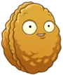          | Wall-nut    | Takes a lot of hits before breaking, protecting other plants.                                         |
| 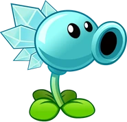        | Snow Pea    | Shoots frozen peas that slow down zombies and reduce their attack speed, but don't deal extra damage. |
| 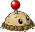 | Potato Mine | Explode on contact, but they take time to arm                                                         |
| 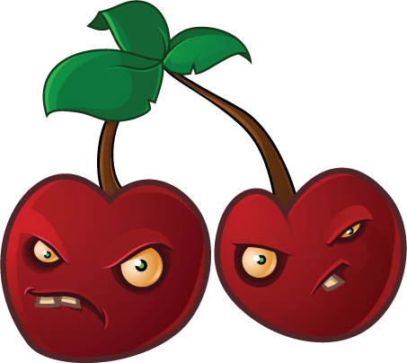  | Cherry Bomb | Explodes and kills all zombies in a 3x3 area.                                                         |

## b. Types of zombies

- There are 5 types of zombies:

|                                         | Zombie Name       | Function                                                                                                             |
|-----------------------------------------|-------------------|----------------------------------------------------------------------------------------------------------------------|
|  | Browncoat Zombie  | Eats your plants and brains.                                                                                         |
|
    | Flag Zombie       | Signals a large wave of zombies incoming.                                                                            |
|
    | Conehead Zombie   | Has three times the health of a regular zombie.                                                                      |
|
  | Buckethead Zombie | Has 6.5 times the health of a regular zombie.                                                                        |
|
    | Door Zombie       | Has 6.5 times the health of a regular zombie and is not affected by frozen peas as long as its door is still intact. |

# 5. Winning and losing

- You will win if you eliminate all zombies in that game.

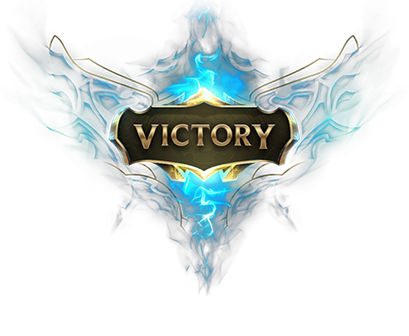

- You will lose if a zombie goes all the way to your house.

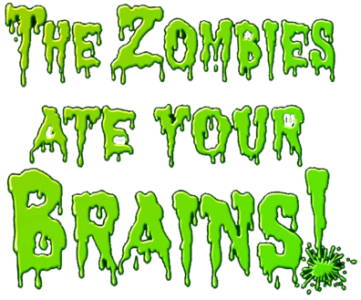

---

### About the game's graphics:

[[Game's graphics]](about_graphics.md)

### About the game's source code:

- Folder "draw":
    - initializes window and renderer
    - contains all images in the game (numbered)
    - contains most of the SDL2, SDL2_image, SDL2_ttf commands, used to load images, text and draw on the renderer,
      window.
- Folder "elements": Contains all components of the game:
    - "bullets": types of bullets
    - "button": types of buttons in the game (can be pressed or not)
    - "Map": contains random function and initializes a 5x9 board for each level.
    - "mower": grass cutter (zombie's obstacle)
    - "plants": contains all types of plants (inherited from Plants class)
    - "zombies": contains all types of zombies (inherited from Zombie class)
    - "elements": gathers all types of plants and zombies.
    - "elements_actions":
        - contains most of the interactions between game components, and with the level.
        - creates zombies randomly
        - updates all game changes every frame.
- Folder "events": Handles game events (mouse, keyboard events)

    - "in_game": handles events during a level
        - "credit": introduces different types of zombies and the concept of "ready-set-plant"
        - "game": handles all events during a level
        - "lose": handles the event of losing
        - "main_menu": handles the event of returning to level selection menu
        - "pause_menu": handles the event of pausing the game (either by pressing the pause button or clicking outside
          of the game)
        - "restart_menu": handles the event of restarting a level
        - "turbo": handles the event of speeding up the game
        - "volume": handles the event of adjusting background music and sound effects volume.
        - "win": handles the event of winning the game.
    - "mouse_cursor": handles the mouse cursor
    - "out_game": handles events outside of a level
        - "choose_level": handles level selection
        - "quit_menu": handles the event of quitting the game
        - "reset_level": handles the event of resetting a level's progress
        - "start_game": handles the event of clicking "Click to start" to enter a level.
        - "unlock_plant": handles the event of unlocking a new plant.

- Folder "level": handles retrieving level data.
- Folder "music": handles game's sound - SDL2_mixer
- Folder "player": handles player data. Includes retrieving and changing name, progress.
- "game_stats.hpp": contains all game parameters.
- "game.hpp" and "game.cpp": main function of the game.
